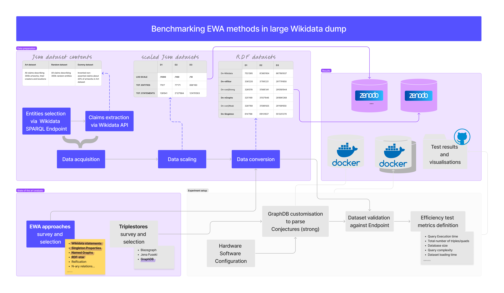

This project can be summarised as follows and it is explained in this README.md file.
# Benchmarking Expressing Without Asserting approaches on large Wikidata Dumps - Notes on Datasets Construction


## Table of contents
- [Data Preparation](#data-preparation)
  - [Data acquisition](#data-acquisition)
  - [Data scaling](#data-scaling)
- [EWA approaches survey and selection](#ewa-approaches-survey-and-selection)
- [Data conversion](#data-conversion)
  - [Assertion vs Non-Assertion Logic](#assertion-vs-non-assertion-logic)
  - [Converting JSON files via Wikidata Converter App](#converting-json-files-via-wikidata-converter-app)
  - [Dataset Validation](#dataset-validation)
- [Example Output RDF Files out of Handlebars Templates](#example-output-rdf-files-out-of-handlebars-templates)
  - [Wikidata](#wikidata)
  - [Named Graphs](#named-graphs)
  - [Singleton Properties](#singleton-properties)
  - [RDF-star (RDF 1.1 syntax extension)](#rdf-star-rdf-11-syntax-extension)
  - [Conjectures (weak form)](#conjectures-weak-form)
  - [Conjectures (strong form)](#conjectures-weak-form)

## Data Preparation

### Data acquisition

The dataset on which these experiments have been run is composed as follows and has been named D3:

- **Art**: A thematic set of claims about 300k artwork entities in Wikidata (i.e., painting, manuscripts, books). This corresponds to about 10% of all artwork entities currently present inside Wikidata (see query below). Scipts are available at `data_acquisition/art_statements`.

```
# Artworks  
SELECT DISTINCT ?artwork ?type WHERE {
    ?artwork wdt:P31 ?type.
    ?type (wdt:P279*) wd:Q838948. hint:Prior hint:rangeSafe true
}
```

- **Random**: after considerable deliberation, we concluded that adding some kind of entropy to the dataset would make it more representative. This dataset contains the claims of 300k Wikidata random entities (see query below). Scripts are available at `data_acquisition/random_statements`.

```
# Random
SELECT DISTINCT * WHERE {
    ?entity wdt:P31 ?type. hint:Prior hint:rangeSafe true
    MINUS { ?type (wdt:P279*) wd:Q838948. }
}
LIMIT 3000000
```

- **Dummy**: a selection of dummy statements regarding the artwork attributions (represented by the property `wdt:P50` and `wdt:P170` and including from 1 to 4 authors in each claim and the source of the claim) and artworks locations (represented by the property `wdt:P276`, including 1 possible location, time constraints and source) has been created. Those new statements contain dummy arbitrary information ranked as deprecated and therefore non-asserted to represent alternative or historical claims to those contained in Art dataset. This design choice was made to increase the number of conjectural statements in the final dataset. Dummy statements have been programmatically produced via Python scripts, all scripts and detailed description is provided in folder `data_acquisition/dummy_statements`.

### Data scaling 

An excellent way to evaluate an algorithm’s performance is to observe how it responds to variations in input size. We started by downloading the whole subset of artwork entities, related individuals (basically, attributed authors), and locations. This dataset, called D4, is composed of about 3,5 million artwork entities and 188 thousand related entities (humans and locations). We have not used this dataset for our comparison due to the excessive number of timeouts in many of the queries and methods we used. Thus we scaled the dataset logarithmically in three further sizes ($Dn, \; n \in [1, 3]$):

- **Dataset D3**: D3 is obtained by extracting one-tenth of the data in D4 (D3 = D4/10).
- **Dataset D2**: D2 is obtained by extracting one-tenth of the data in D3 (D2 = D3/10).
- **Dataset D1**: D1 is obtained by extracting one-tenth of the data in D2 (D1 = D2/10).

## EWA approaches survey and selection
We then surveyed the state of the art regarding reification methods to express without asserting and selected a set of methods for our analysis: **Singleton properties**, **Named graphs** (using Wikidata rankings to decide whether a triple is asserted or not), **Wikidata**, and the recent **RDF-star** approach. 

## Data conversion
We converted Wikidata JSON files into the six selected reification methods in order to have for each dataset a set of asserted and non-asserted claims. 

<!-- TOC --><a name="conversion-rationale"></a>
### Assertion vs Non-Assertion Logic
In Wikidata, assertion or non-assertion of claims is strictly dependent on their rankings. Ranking information is present in the JSON files, so we established a logic to reconstruct the assertion/non assertion logic to mimic Wikidata RDF statements.

For example, the triples (1) ```wd:Q10743 wdt:P214 "249422654"``` and (2) ```wd:Q10743 wdt:P214 "315523483"``` share the same subject-predicate values, but differ wrt their objects.
| Ranking for <br> triple 1 | Ranking for <br> triple 2 | Assertion Status |
|----------|----------|------------------|
| Normal   | Normal   | Asserted         |
| Preferred| Preferred| Asserted         |
| Deprecated | Deprecated | Non-asserted  |
| Preferred| Normal   | Triple 1: Asserted <br> Triple 2: Non-asserted |
| Deprecated | Normal | Triple 1: Non-asserted <br> Triple 2: Asserted |
| Deprecated | Preferred | Triple 1: Non-asserted <br> Triple 2: Asserted |

In the case of Conjectures (both strong and weak form) this logic is slightly different due to a more nuanced way of expressing without asserting:
| Triple 1   | Triple 2   | Graph Type                      | Assertion status |
|------------|------------|---------------------------------|------------------|
| Normal     | Normal     | Named Graph	                    | Asserted |
| Preferred  | Preferred  | Collapsed Conjectures           | Asserted + non-asserted |
| Deprecated | Deprecated | Conjectures                     | Non-asserted |
| Preferred  | Normal     | Triple 1: Collapsed Conjecture <br> Triple 2: Conjecture | Triple 1: Asserted + non-asserted <br> Triple 2: Non-asserted |
| Deprecated | Normal     | Triple 1: Conjecture <br> Triple 2: Collapsed Conjecture | Triple 1: Non-asserted <br> Triple 2:  Asserted + non-asserted  |
| Deprecated | Preferred  | Triple 1: Conjecture <br> Triple 2: Collapsed Conjecture | Triple 1: Non-asserted <br> Triple 2:  Asserted + non-asserted  |

### Converting JSON files via Wikidata Converter App
- The assertion vs non-assertion logic has been translated into a set of templates each of which has been customised to convert the JSON files in $Dn, \; n \in [1, 3]$ in one of the selected EWA approaches. Such templates are written in [Handelbars syntax](https://handlebarsjs.com/). All templates are available in a dedicated repository available at [conjectures-rdf/wikidata-converter-json-to-rdf/](https://github.com/conjectures-rdf/wikidata-converter-json-to-rdf/). This set of templates has been used to convert **Art** and **Random** claims.
- Similarly, another set of templates which are available at ```data_conversion/handlebars_templates_dummy``` has been designed to convert JSON files in $Dn, \; n \in [1, 3]$ storing the **Dummy** claims. 
- Such Handlebar templates can be uploaded via an interface in a Node.js application designed for the purpose. An online version of the web app can be found at [https://www.fabiovitali.it/wikidataconverter/](https://www.fabiovitali.it/wikidataconverter/). In particular, the web app receives a JSON datasets and the handlebars templates and produces a RDF dataset with the data provided in the JSON dataset following the rules expressed in the handlebar templates.
- Due to the large size of JSON datasets, this web app can be run locally to make some bulk conversions. The application is stored in the folder `data_conversion/Wikidata_Converter_App/`.
	- Start the application by simply starting node with the command ```node app.js```, the interface will be available in your browser at port `3000`.
	- In the interface, upload the templates (available in folder ```data_conversion/handlebars_templates``` and ```data_conversion/handlebars_templates_fake```) or fill the dedicated forms.
	- Use "Bulk convert" function to upload a .zip archive containing all JSONS files.
    	- Note. Do not upload a .zip file grater than 2GB.
    	- Note 2. If the process stops, allocate more RAM space in the cmd with the command ```node --max-old-space-size=12288 app.js``` to run again the application.
	- A .zip folder will be automatically downloaded. This archive contains all RDF files converted against your chosen templates.  
	- Disclaimer: In folder ```data_conversion``` you can find an additional set of helpers called ```helper.js```, this is meant to be use in data conversions since it reproduces the assertion - non assertion of the statements in the json files.
   
In the table below we provide some data about our datasets. At the end of this process, we obtained 18 new method-specific datasets. In other words, for each dataset $Dn, \; n \in [1, 3]$, we constructed the following datasets:

| **name**           | **Serialization** | **Reification**             | **EWA**         | **# RDF stmts in D3** |
|-------------------|-------------------|-----------------------------|-----------------|-----------------------|
| Dn-Wikidata       | Turtle            | Wikidata                    | yes             | 66,768,937           |
| Dn-rdfStar        | Turtle            | RDF-star                    | yes             | 29,779,850           |
| Dn-conjStrong     | TriG              | Conjectures - strong form   | yes             | 29,058,944           |
| Dn-nGraphs        | TriG              | Named graphs                | via ranking     | 28,896,268           |
| Dn-conjWeak       | TriG              | Conjectures - weak form     | yes             | 29,199,650           |
| Dn-Singleton      | Turtle            | Singleton properties        | yes             | 55,325,270           |

<!-- TOC --><a name="example-output-rdf-files-out-of-handlebars-templates"></a>
### Dataset Validation
RDF datasets have been validated by uploading them in Triplestore. Below a summary for each dataset applied against each model in Jena Fuseki:

| ** D1 **             | Upload time (ms) | Total Triples |  Query Time (ms) |  Query                                       | Queried Triples  |
|----------------------|------------------|---------------|------------------|----------------------------------------------|------------------|
| Wikidata Statement   |   18,904         |  853,028      | 32,860           | SELECT * WHERE {?s ?p ?o}                    |   751,332        |
| Singleton Properties |   12,034         |  695,022      | 12,375           | SELECT * WHERE {?s ?p ?o}                    |   334,955        |
| Named Graphs         |   15,428         |  364,150      | 6,901            | SELECT * WHERE {?s ?p ?o}                    |   184,813        |
| RDF-star             |   12,556         |  379,010      | 7,985            | SELECT * WHERE {<< ?s ?p ?o >>} ?p1 ?o1      |   163,975        |
| Conjectures          |   13,419         |  369,527      | 8,962            | SELECT * WHERE {?s ?p ?o}                    |   184,813        |

| ** D2 **             | Upload time (ms) | Total Triples |  Query Time (ms) |  Query                                       | Queried Triples  |
|----------------------|------------------|---------------|------------------|----------------------------------------------|------------------|
| Wikidata Statement   |  172.638         |  11,337,988   | 25.975           | SELECT * WHERE {?s ?p ?o} LIMIT 1000000      |    1000000       |         
| Singleton Properties |  104.060         |   9,229,518   | 17.282           | SELECT * WHERE {?s ?p ?o} LIMIT 1000000      |    1000000       |
| Named Graphs         |  116.632         |   4,742,770** | 27.431           | SELECT * WHERE {?s ?p ?o} LIMIT 1000000      |    1000000       |
| RDF-star             |   66.617         |   5,012,578   | 43.739           | SELECT * WHERE { << ?s ?p ?o >> ?p1 ?o1}     |    1000000       |
| Conjectures          |  119.180         |   4,810,697** | 26.988           | SELECT * WHERE {?s ?p ?o} LIMIT 1000000      |    1000000       |

* The _Query Time (ms)_ has been calculated over the query: ```SELECT * WHERE {?s ?p ?o}```
** Total number of Quads

Each converted dataset is exemplified below with two different examples:
1) The first represents two statements (_Germany native label is Bundesrepublik Deutschland_ and _Germany native label is Deutschland_) both ranked as normal, and then equally asserted.
2) The second represents three statements (_Germany has diplomatic relation with Taiwan_, _Germany has diplomatic relation with Bhutan_ (unconfirmed statement), _Germany has diplomatic relation with Cape Verde_) respectively rankes as normal (non asserted), deprecated (non asserted), preferred (asserted)

<!-- TOC --><a name="wikidata"></a>
#### Wikidata

```
wd:Q183 wdt:P1705 "Bundesrepublik Deutschland"@de.
wd:Q183 p:P1705 s:Q183-d657d418-4a25-98d6-5180-a3659a11fbcd .
s:Q183-d657d418-4a25-98d6-5180-a3659a11fbcd a wikibase:Statement;                                  
    ps:P1705 "Bundesrepublik Deutschland"@de;
    wikibase:rank wikibase:NormalRank.                                   

wd:Q183 wdt:P1705 "Deutschland"@de.      
wd:Q183 p:P1705 s:Q183$E2A638D7-78B7-424D-9F63-AF49F5DCAE84 .
s:Q183-E2A638D7-78B7-424D-9F63-AF49F5DCAE84 a wikibase:Statement;
    ps:P1705 "Deutschland"@de;
    wikibase:rank wikibase:NormalRank.
```    
```
wd:Q183 p:P530 s:Q183-DF432913-CEBA-49ED-BCA4-7214957E6CDA .
s:Q183-DF432913-CEBA-49ED-BCA4-7214957E6CDA a wikibase:Statement;                                     
    pq:P805 wd:Q15910813;
    pq:P582 "1972-00-00T00:00:00Z"^^xsd:dateTime;
    pq:P2241 wd:Q26256296;
    ps:P530 wd:Q865;
    wikibase:rank wikibase:NormalRank.

wd:Q183 p:P530 s:Q183-a6aa383f-4c30-79bf-0767-dcf4ea80f8d6 .
s:Q183-a6aa383f-4c30-79bf-0767-dcf4ea80f8d6 a wikibase:Statement;
    pq:P805 wd:Q1201896;
    pq:P2241 wd:Q28831311;
    ps:P530 wd:Q917;
    wikibase:rank wikibase:DeprecatedRank.

wd:Q183 wdt:P530 wd:Q1011.
wd:Q183 p:P530 s:Q183-0B26503A-A8BF-4B40-9F0A-CAE242AE03A1 .
s:Q183-0B26503A-A8BF-4B40-9F0A-CAE242AE03A1 a wikibase:Statement;
    pq:P805 wd:Q28498636;
    pq:P531 wd:Q58003162;
    ps:P530 wd:Q1011;
    wikibase:rank wikibase:PreferredRank.
```

<!-- TOC --><a name="named-graphs"></a>
#### Named Graphs
Note: With named graphs all statements are asserted.  
Note2: Since Named Graphs allows for statements groupings, when all statements are ranked as Normal (or all has the same qualifiers) as the case below, they can be grouped in the same graph without changing any statement meaning.

```
GRAPH s:Q183-d657d418-4a25-98d6-5180-a3659a11fbcd {
    wd:Q183 wdt:P1705 "Bundesrepublik Deutschland"@de
    wd:Q183 wdt:P1705 "Deutschland"@de
}
s:Q183-d657d418-4a25-98d6-5180-a3659a11fbcd wikibase:rank wikibase:NormalRank.
```
```
GRAPH s:Q183-DF432913-CEBA-49ED-BCA4-7214957E6CDA {
wd:Q183 wdt:P530 wd:Q865
}
s:Q183-DF432913-CEBA-49ED-BCA4-7214957E6CDA pq:P805 wd:Q15910813.
s:Q183-DF432913-CEBA-49ED-BCA4-7214957E6CDA pq:P582 "1972-00-00T00:00:00Z"^^xsd:dateTime.
s:Q183-DF432913-CEBA-49ED-BCA4-7214957E6CDA pq:P2241 wd:Q26256296.
s:Q183-DF432913-CEBA-49ED-BCA4-7214957E6CDA wikibase:rank wikibase:NormalRank.

GRAPH s:Q183-a6aa383f-4c30-79bf-0767-dcf4ea80f8d6 {
    wd:Q183 wdt:P530 wd:Q917
}
s:Q183-a6aa383f-4c30-79bf-0767-dcf4ea80f8d6 pq:P805 wd:Q1201896.
s:Q183-a6aa383f-4c30-79bf-0767-dcf4ea80f8d6 pq:P2241 wd:Q28831311.
s:Q183-a6aa383f-4c30-79bf-0767-dcf4ea80f8d6 wikibase:rank wikibase:DeprecatedRank.

GRAPH s:Q183-0B26503A-A8BF-4B40-9F0A-CAE242AE03A1 {
    wd:Q183 wdt:P530 wd:Q1011 								
}
s:Q183-0B26503A-A8BF-4B40-9F0A-CAE242AE03A1 pq:P805 wd:Q28498636.
s:Q183-0B26503A-A8BF-4B40-9F0A-CAE242AE03A1 pq:P531 wd:Q58003162.
s:Q183-0B26503A-A8BF-4B40-9F0A-CAE242AE03A1 wikibase:rank wikibase:PreferredRank.

```

<!-- TOC --><a name="singleton-properties"></a>
#### Singleton Properties
```
wd:Q183 wdt:P1705 "Bundesrepublik Deutschland"@de.
sng:P417-0 sng:singletonPropertyOf wdt:P417  ;
sng:P1705-0 sng:singletonPropertyOf wdt:P1705 ;
    wikibase:rank wikibase:NormalRank.

wd:Q183 wdt:P1705 "Deutschland"@de.
wd:Q183 sng:P1705-1 "Deutschland"@de.
sng:P1705-1 sng:singletonPropertyOf wdt:P1705  ;
    wikibase:rank wikibase:NormalRank.
```
```
wd:Q183 sng:P530-136 wd:Q865.
sng:P530-136 sng:singletonPropertyOf wdt:P530  ;
    pq:P805 wd:Q15910813;
    pq:P582 "1972-00-00T00:00:00Z"^^xsd:dateTime;
    pq:P2241 wd:Q26256296;
    wikibase:rank wikibase:NormalRank.

wd:Q183 sng:P530-132 wd:Q917.
sng:P530-132 sng:singletonPropertyOf wdt:P530  ;
    pq:P805 wd:Q1201896;
    pq:P2241 wd:Q28831311;
    wikibase:rank wikibase:DeprecatedRank.

wd:Q183 sng:P530-133 wd:Q1011.
sng:P530-133 sng:singletonPropertyOf wdt:P530  ;
sng:Q183-0B26503A-A8BF-4B40-9F0A-CAE242AE03A1 sng:singletonPropertyOf wdt:P530 .
    pq:P805 wd:Q28498636;
    pq:P531 wd:Q58003162;
    wikibase:rank wikibase:PreferredRank.
```

<!-- TOC --><a name="rdf-star-rdf-11-syntax-extension"></a>
#### RDF-star (RDF 1.1 syntax extension)
```
wd:Q183 wdt:P1705 "Bundesrepublik Deutschland"@de.
<<wd:Q183 wdt:P1705 "Bundesrepublik Deutschland">>
     wikibase:rank wikibase:NormalRank.

wd:Q183 wdt:P1705 "Deutschland"@de.
<<wd:Q183 wdt:P1705 "Deutschland">>
     wikibase:rank wikibase:NormalRank.
```
```
<<wd:Q183 wdt:P530 wd:Q865>>
    pq:P805 wd:Q15910813;
    pq:P582 "1972-00-00T00:00:00Z"^^xsd:dateTime;
    pq:P2241 wd:Q26256296;
    wikibase:rank wikibase:NormalRank.

<<wd:Q183 wdt:P530 wd:Q917>>
    pq:P805 wd:Q1201896;
    pq:P2241 wd:Q28831311;
    wikibase:rank wikibase:DeprecatedRank.

wd:Q183 wdt:P530 wd:Q1011.
<<wd:Q183 wdt:P530 wd:Q1011>>
    pq:P805 wd:Q28498636;
    pq:P531 wd:Q58003162;
    wikibase:rank wikibase:PreferredRank.
```

<!-- TOC --><a name="conjectures-weak-form"></a>
#### Conjectures (weak form)
Note: Since conjectures allows for statements groupings (inheriting it from Named Graphs), when all statements are ranked as Normal (or all has the same qualifiers) as the case below, they can be grouped in the same graph without changing any statement meaning.
```
GRAPH s:Q183-d657d418-4a25-98d6-5180-a3659a11fbcd  {
wd:Q183 wdt:P1705 "Bundesrepublik Deutschland"@de.
wd:Q183 wdt:P1705 "Deutschland"@de.
}
s:Q183-d657d418-4a25-98d6-5180-a3659a11fbcd wikibase:rank wikibase:NormalRank.                        
```
```
GRAPH s:Q183-DF432913-CEBA-49ED-BCA4-7214957E6CDA  {
	wd:Q183 <http://w3id.org/conj-wikidata-test/conj/Q183P530136/P530> wd:Q865.
	<http://w3id.org/conj-wikidata-test/conj/Q183P530136/P530> conj:isAConjecturalFormOf wd:P530 .
}
s:Q183-DF432913-CEBA-49ED-BCA4-7214957E6CDA pq:P805 wd:Q15910813.
s:Q183-DF432913-CEBA-49ED-BCA4-7214957E6CDA pq:P582 "1972-00-00T00:00:00Z"^^xsd:dateTime.
s:Q183-DF432913-CEBA-49ED-BCA4-7214957E6CDA pq:P2241 wd:Q26256296.
s:Q183-DF432913-CEBA-49ED-BCA4-7214957E6CDA wikibase:rank wikibase:NormalRank.   

GRAPH s:Q183-a6aa383f-4c30-79bf-0767-dcf4ea80f8d6  {
	wd:Q183 <http://w3id.org/conj-wikidata-test/conj/Q183P530132/P530> wd:Q917.
	<http://w3id.org/conj-wikidata-test/conj/Q183P530132/P530> conj:isAConjecturalFormOf wd:P530 .
}
s:Q183-a6aa383f-4c30-79bf-0767-dcf4ea80f8d6 pq:P805 wd:Q1201896.
s:Q183-a6aa383f-4c30-79bf-0767-dcf4ea80f8d6 pq:P2241 wd:Q28831311.
s:Q183-a6aa383f-4c30-79bf-0767-dcf4ea80f8d6 wikibase:rank wikibase:DeprecatedRank.   

GRAPH s:Q183-0B26503A-A8BF-4B40-9F0A-CAE242AE03A1  {
        wd:Q183 wdt:P530 wd:Q1011.
}

GRAPH s:Q183-0B26503A-A8BF-4B40-9F0A-CAE242AE03A1  {
        wd:Q183 <http://w3id.org/conj-wikidata-test/conj/Q183P530133/P530> wd:Q1011.
	<http://w3id.org/conj-wikidata-test/conj/Q183P530133/P530> conj:isAConjecturalFormOf wd:P530 .  
}      

GRAPH s:collapseOfQ183-0B26503A-A8BF-4B40-9F0A-CAE242AE03A1{
        wd:Q183 wdt:P530 wd:Q1011.
        s:collapseOfQ183-0B26503A-A8BF-4B40-9F0A-CAE242AE03A1 conj:collapses s:Q183-0B26503A-A8BF-4B40-9F0A-CAE242AE03A1
}
s:Q183-0B26503A-A8BF-4B40-9F0A-CAE242AE03A1 pq:P805 wd:Q28498636.
s:Q183-0B26503A-A8BF-4B40-9F0A-CAE242AE03A1 pq:P531 wd:Q58003162.
s:Q183-0B26503A-A8BF-4B40-9F0A-CAE242AE03A1 wikibase:rank wikibase:PreferredRank.   
```

<!-- TOC --><a name="conjectures-weak-form"></a>
#### Conjectures (strong form)
Note: Since conjectures allows for statements groupings (inheriting it from Named Graphs), when all statements are ranked as Normal (or all has the same qualifiers) as the case below, they can be grouped in the same graph without changing any statement meaning.
```
GRAPH s:Q183-d657d418-4a25-98d6-5180-a3659a11fbcd  {
wd:Q183 wdt:P1705 "Bundesrepublik Deutschland"@de.
wd:Q183 wdt:P1705 "Deutschland"@de.
}
s:Q183-d657d418-4a25-98d6-5180-a3659a11fbcd wikibase:rank wikibase:NormalRank.                        
```
```
CONJ s:Q183-DF432913-CEBA-49ED-BCA4-7214957E6CDA  {
	wd:Q183 wdt:P530 wd:Q865.
}
s:Q183-DF432913-CEBA-49ED-BCA4-7214957E6CDA pq:P805 wd:Q15910813.
s:Q183-DF432913-CEBA-49ED-BCA4-7214957E6CDA pq:P582 "1972-00-00T00:00:00Z"^^xsd:dateTime.
s:Q183-DF432913-CEBA-49ED-BCA4-7214957E6CDA pq:P2241 wd:Q26256296.
s:Q183-DF432913-CEBA-49ED-BCA4-7214957E6CDA wikibase:rank wikibase:NormalRank.   

CONJ s:Q183-a6aa383f-4c30-79bf-0767-dcf4ea80f8d6  {
	wd:Q183 wdt:P530 wd:Q917.
}
s:Q183-a6aa383f-4c30-79bf-0767-dcf4ea80f8d6 pq:P805 wd:Q1201896.
s:Q183-a6aa383f-4c30-79bf-0767-dcf4ea80f8d6 pq:P2241 wd:Q28831311.
s:Q183-a6aa383f-4c30-79bf-0767-dcf4ea80f8d6 wikibase:rank wikibase:DeprecatedRank.   


COLLAPSED CONJECTURE s:Q183-0B26503A-A8BF-4B40-9F0A-CAE242AE03A1  {
        wd:Q183 wdt:P530 wd:Q1011.
}      
s:Q183-0B26503A-A8BF-4B40-9F0A-CAE242AE03A1 pq:P805 wd:Q28498636.
s:Q183-0B26503A-A8BF-4B40-9F0A-CAE242AE03A1 pq:P531 wd:Q58003162.
s:Q183-0B26503A-A8BF-4B40-9F0A-CAE242AE03A1 wikibase:rank wikibase:PreferredRank.   
```
